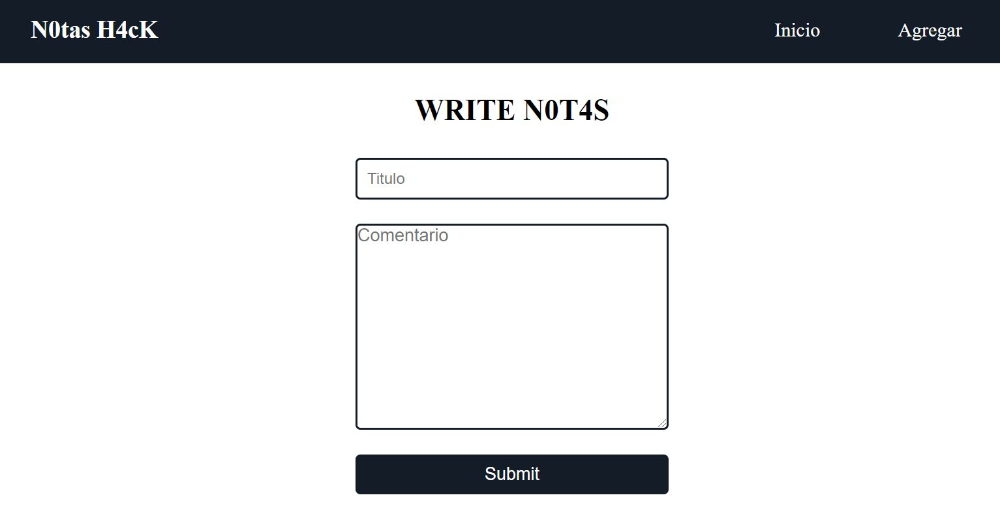

# Crud_Python_AppWeb
Este es un proyecto web CRUD => Crear-Leer-Actualizar-Borrar 
Creado en Python-Html5-Css-Flask y SqlAlchemy para agregar notas

Descarga los archivo e inicia ejecutando el archivo app.py

Luego abre un navegador y ejecuta en el local host 127.0.0.1:5000

Click en Agregar y Escribes la nota que deseas guardar.

